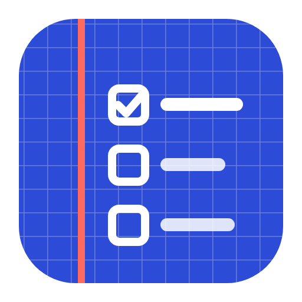

<p align="center">
  
</p>

<h1 align="center">Gridnote</h1>

<p align="center">
  A desktop task board for game developers.<br>
  Bugs, ideas, to-dos and the files that go with them, in one place, on your own computer.
</p>

---

## Why Gridnote

Game projects create a lot of loose notes: a bug you spotted while play-testing, an idea for a new mechanic, a list of UI fixes, a sprite that still needs a transparent background. Gridnote keeps them organized without getting in the way.

- **Works offline.** Everything is stored on your computer. No account, no cloud.
- **Edit like a text editor.** Click any task and type. There is no edit mode and no Save button.
- **Made for game assets.** Keep sprites, textures, 3D models, sounds, videos and scripts next to the tasks they belong to.

## Features

### Tasks
- **Projects and sections.** One project per game, split into sections such as *Bugs*, *UI* or *Levels*.
- **Inline editing.** `Enter` adds a task below, `Backspace` on an empty task removes it, and the arrow keys move between tasks.
- **Quick add.** Every section has an input at the top, so a long list never pushes it out of reach.
- **Priority stars.** Rate a task from ★ to ★★★, and use *Sort by priority* to bring the most important ones to the top.
- **Labels.** Bug, Important, To check, Idea, In progress and Blocked. Pick them from a menu, combine as many as you need, and filter by any of them.
- **Drag and drop.** Reorder tasks, move them between sections, and rearrange the sections themselves.
- **Paste your notes.** Paste a list from Notepad and it becomes sections and tasks automatically (see below).
- **Undo.** Deleting a task or a section can be undone from the notification.

### Assets
- **Any file type.** Drag files in from File Explorer, use **Add files**, or paste with `Ctrl+V`.
- **Attach files to work.** Drop a file on a task or a section to attach it, or choose where it belongs in the file details.
- **Previews:**

  | Type | Preview |
  |---|---|
  | Images (PNG, JPG, WEBP, GIF, SVG, BMP) | Checkerboard, light and dark backgrounds to check transparency; size, aspect ratio and a power-of-two check for textures |
  | 3D models (GLB, glTF, FBX, OBJ, STL) | Orbit viewer with mesh and triangle counts; built-in **animations play** and can be switched |
  | Audio (WAV, MP3, OGG, FLAC, M4A) | Player with duration |
  | Video (MP4, WEBM, MOV) | Player with resolution and duration |
  | Code and text (Lua, C#, GDScript, JSON, Markdown and more) | Read-only text view |
  | Everything else (`.blend`, `.psd`, `.rbxm` and so on) | **Open** in its own app or **Show in folder** |

### Feel
- **Satisfying feedback.** Completing a task plays a short chime and a burst of confetti. Quick streaks climb in pitch, and finishing a whole section or project gets a bigger celebration.
- **Sounds can be muted** from the sidebar or with `Ctrl+M`.
- **Dark, quiet interface** that stays out of the way of your work.

## Download

Gridnote is built for Windows automatically by GitHub Actions.

1. Open the **Actions** tab of this repository.
2. Click the latest **Build for Windows** run with a green ✓.
3. Under **Artifacts**, download one of these:
   - **Gridnote-Setup**: an installer that adds Start menu and desktop shortcuts.
   - **Gridnote-Portable**: a single `.exe` that runs without installing.
4. Unzip the download and run the `.exe`.

> **Windows SmartScreen:** because the app isn't signed with a paid certificate, Windows may show *“Windows protected your PC”*. Click **More info → Run anyway**.

## Pasting notes

Paste text in this format with **File → Paste Notes…** (`Ctrl+I`):

```text
BUGS:
-- pickaxe sometimes drops 3-5 shards of the same level
-- upgrade button doesn't work on mobile - to check

UI:
-- no transparent background on the shop icons
-- price pill is misaligned
   (it only happens on small screens)
```

- A line ending with a colon (`BUGS:`) starts a section.
- A line starting with `--`, `-`, `*` or `•` becomes a task. `[x]` marks it as done.
- A line without a dash is added to the task above it.
- Tasks containing “to check” get the **To check** label automatically.

## Keyboard shortcuts

| Shortcut | Action |
|---|---|
| `Enter` | New task below the current one (splits the text at the cursor) |
| `Shift+Enter` | New line inside a task |
| `Ctrl+Enter` | Mark the task as done or not done |
| `Backspace` on an empty task | Delete it and jump to the previous one |
| `↑` / `↓` | Move between tasks |
| `Esc` | Stop editing / close a window |
| `Ctrl+F` | Search |
| `Ctrl+1` / `Ctrl+2` | Tasks / Assets |
| `Ctrl+I` | Paste notes |
| `Ctrl+O` | Add files |
| `Ctrl+Shift+N` | New project |
| `Ctrl+M` | Sounds on or off |

## Your data

Everything lives in `%APPDATA%\Gridnote`:

| Path | Contents |
|---|---|
| `gridnote-data.json` | All projects, sections and tasks |
| `gridnote-data.json.bak` | The previous version, saved once per session |
| `assets\` | Copies of every file you added |

Use **Open data folder** in the sidebar to get there quickly, and **File → Export Backup…** to save a copy of your projects somewhere else.

## Development

Requires [Node.js](https://nodejs.org) 20 or newer.

```bash
npm install
npm start          # run the app
npm run dist       # build the Windows installer and portable .exe into dist/
npm run vendor     # refresh the bundled three.js files after updating the package
```

| File | Purpose |
|---|---|
| `main.js` | Electron main process: window, menu, saving data, copying and serving files |
| `preload.js` | The safe bridge between the window and the file system |
| `src/index.html`, `src/styles.css` | Layout and theme |
| `src/app.js` | The app: tasks, drag and drop, files, sounds and effects |
| `src/viewer.js` | 3D model preview, loaded on demand |
| `src/vendor/three/` | The parts of [three.js](https://threejs.org) used by the viewer (MIT license) |

## License

MIT
